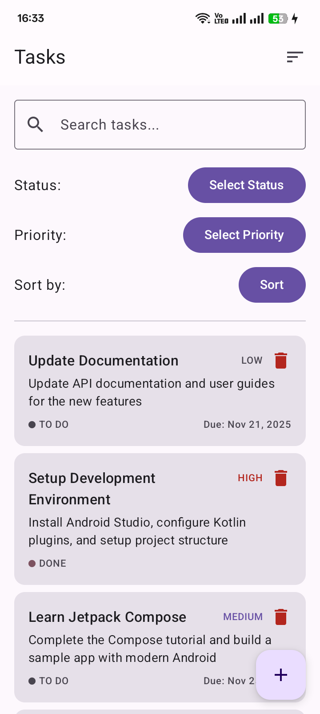
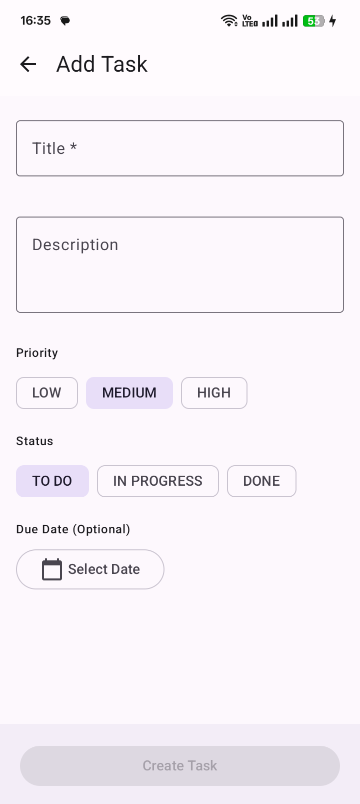

# 📝 Task Management System

A modern, cross-platform Task Management application built with **Kotlin Multiplatform (KMP)**
featuring a shared business logic layer and native Android UI with Jetpack Compose.


## 🚀 Features

### ✨ Core Functionality

- ✅ **Complete CRUD Operations** - Create, Read, Update, Delete tasks
- 📋 **Rich Task Details** - Title, Description, Priority, Status, Due Date
- 🎯 **Priority Levels** - Low, Medium, High with color coding
- 📊 **Status Tracking** - To Do, In Progress, Done with visual indicators
- ⏰ **Due Date Management** - Set deadlines and track overdue tasks
- 📅 **Smart Date Formatting** - Relative dates (Today, Tomorrow, Yesterday)

### 🔍 Advanced Features

- 🔍 **Smart Search** - Real-time search tasks by title
- 🎛️ **Advanced Filtering** - Filter by status and priority
- 📈 **Multiple Sorting** - Sort by date, priority, or status
- 💾 **Local Storage** - Room database for offline functionality
- 🎨 **Modern UI** - Material Design 3 with Jetpack Compose
- 📱 **Responsive Design** - Optimized for mobile devices

### 🏗️ Architecture

- 🏗️ **MVVM Pattern** - Clean architecture separation
- 🌐 **Kotlin Multiplatform** - Shared business logic
- 💉 **Dependency Injection** - Koin for DI management
- 🗄️ **Room Database** - Local data persistence with Flow
- 🔄 **Reactive UI** - Compose with StateFlow and Coroutines
- 🧪 **Input Validation** - Real-time form validation

## 📸 Screenshots

<div align="center">

| Task List                                                         | Add Task                                                        | Edit Task                                                         |
|-------------------------------------------------------------------|-----------------------------------------------------------------|-------------------------------------------------------------------|
|  |  |  |

</div>

### 📱 Frontend

- **Android**: Jetpack Compose, Material Design 3
- **Navigation**: Compose Navigation with type-safe routes
- **State Management**: ViewModel + StateFlow + Coroutines
- **UI Components**: Custom composables with proper states (Loading, Error, Empty)

### 🔧 Backend & Shared

- **Kotlin Multiplatform**: Shared business logic across platforms
- **Database**: Room with Coroutines Flow
- **Dependency Injection**: Koin
- **Serialization**: Kotlinx Serialization
- **Date/Time**: kotlinx-datetime for multiplatform date handling

### 🏗️ Architecture

- **Pattern**: MVVM (Model-View-ViewModel)
- **Local Storage**: Room Database with DAO pattern
- **Data Layer**: Repository pattern with Use Cases
- **Async Operations**: Kotlin Coroutines with Flow
- **Navigation**: Type-safe navigation with Compose Destinations

## 🏃‍♂️ Getting Started

### Prerequisites

- **Android Studio** Hedgehog or later
- **Android SDK** 34+
- **Kotlin** 1.9.0+
- **Gradle** 8.0+

### Installation

1. **Clone the repository**
   ```bash
   git clone https://github.com/afjalAn1512/TaskManagementSystem.git
   cd task-management-system

2. **Open in Android Studio**

- Open Android Studio

- Select "Open" and choose the project directory

- Wait for Gradle sync to complete

3. **Build and Run**

- Connect an Android device or start an emulator (API 24+)

- Click "Run" or press Shift + F10

### Development Setup

1. **Fork the repository**
2. **Create a feature branch:** git checkout -b feature/amazing-feature
3. **Commit changes:** git commit -m 'Add amazing feature'
4. **Push to branch:** git push origin feature/amazing-feature
5. **Open a Pull Request**

### Code Style
- Follow Kotlin coding conventions
- Use meaningful variable names
- Add comments for complex logic
- Write unit tests for new features
- Use Compose best practices for UI components


## License

```
Copyright 2023 The Android Open Source Project
 
Licensed under the Apache License, Version 2.0 (the "License");
you may not use this file except in compliance with the License.
You may obtain a copy of the License at

    https://www.apache.org/licenses/LICENSE-2.0

Unless required by applicable law or agreed to in writing, software
distributed under the License is distributed on an "AS IS" BASIS,
WITHOUT WARRANTIES OR CONDITIONS OF ANY KIND, either express or implied.
See the License for the specific language governing permissions and
limitations under the License.
```